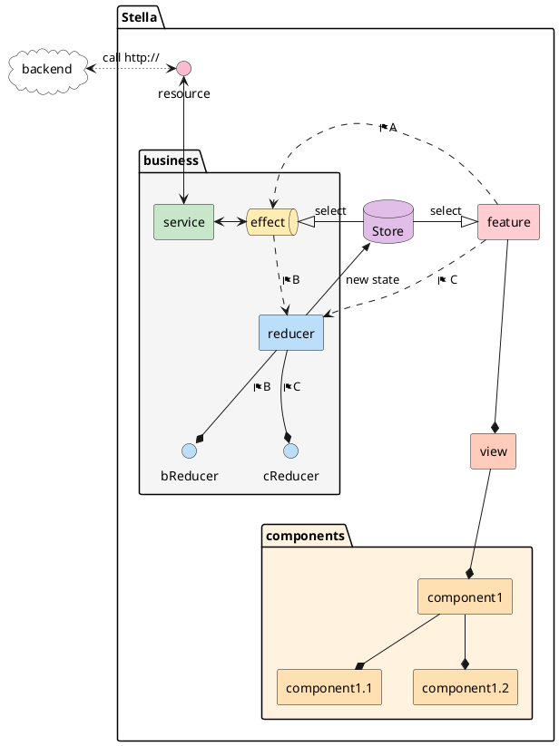
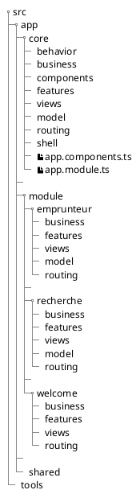

# Architecture features / views

On utilise le pattern features/views, ou autrement appelé smart/dumb component.
Le principe est de découplé la partie présentation de la relation avec la logique métier.

En pratique, pour une url donnée, on a :

- un component dit "feature"
- un component dit "view"

## Components

### Feature

La "feature" peut avoir en dépendance :

- le router pour récupérer des paramètres de l'url
- les services
- la store, si le pattern flux est utilisé

Son rôle est de :

- récupérer toutes les informations nécéssaire à l'affichage de la page,
- déclencher les actions de mise à jour, ou de changement de route.

On posera par convention sur le projet, une feature se nommera `xxxFeatureComponent`, et son module `xxxFeatureModule`.

### View

La "view" n'a que des dépendances lié à l'affichage, comme FormGroup ou une librairie de composants.

Son rôle est :

- afficher la page en fonction de ce qu'il reçoit en Input
- de propager des demandes de modification ou de routage via des Output

On posera par convention sur le projet, une view se nommera `xxxPresenterComponent` ou `xxxEditorComponent`, et son module `xxxPresenterModule` ou `xxxEditorModule`.
Si la view permet d'éditer un modèle de données, alors le component se nommera `xxxEditorComponent`, sinon `xxxPresenterComponent`.

## Avantages

- Séparer le code de "tuyauterie" (appel de service, store et router), de celui de l'affichage et sa logique intrinsèque (affichage ou non de certaine zone, gestion des couleurs, etc).
- La view peut être testé indépendamment du reste de l'application. De ce faite, celle-ci peut et doit être documenté via storybook. Ainsi, on peut avoir accès à l'ensemble des écrans de l'application sans avoir à la lancer.
- Les tests unitaires :
  - simple côté feature car il ne s'agit que de tester la "tuyauterie" : appel du bon service lors du déclenchement de tel méthode
  - pouvant être automatisé côté view, via les stories et l'addon storyshot de storybook.
- Une view peut être utilisé par différentes feature.
- Une view est indépendante du contexte dans lequel elle est appelé : en pleine page, sous-composant, en modal.

## Inconvénients

- Le nombre de composants nécéssaire pour afficher une page.
- Toutes les informations doivent être passé en input de la view. Pas d'appel de service ou de lien à une store de donnée.

# Architecture Flux

On utilise le pattern flux, avec l'implémentation de NgRx.

La documentation officielle de NgRx est disponible sur : https://ngrx.io/docs

## Concept général



But :

- Séparer les responsabilités (testabilité, lisibilité)
- Centraliser l'accès à la donnée
- Outil de debug

On appellera, l'ensemble des données de l'application, le **state**

Le state est centralisé dans la **store**.

Les **reducers** peuvent modifier indirectement le state.

Les **effects** effectue des effets de bords, comme des appels de web-service.

On interroge la store en sélectionnant une partie du state global, via des **selectors**.

## Traitements spécifiques hors NgRx

But :

- Eviter l'excès de code boiler-plate
- Tester uniquement le code métier

### Les actions

Une action :

- sera nommée _<nom de l'action>Action_, en UpperCamelCase.
- étendra GenericAction
- Aura un payload ou des params

```typescript
// my-business.action.ts
import { GenericAction } from 'tools/ngrx';

export class InitMyBusinessAction extends GenericAction {}

export class UpdateMyBusinessAction extends GenericAction {
  constructor(public payload: { dateEffet: Date }) {
    super();
  }
}

export class SaveMyBusinessAction extends GenericAction {
  constructor(public params: { estimationId: string }) {
    super();
  }
}
```

## Les reducers

Pour enregistrer des reducers à la store, créer un reducer pour encapsuler les réducers d'une feature, avec la méthode `createReducer` de `tools/ngrx` :

```typescript
// my-business.reducer.ts
import { Action, State } from '@ngrx/store';
import { createReducer } from 'tools/ngrx';
import * as actions from './my-business.actions';
import * as reducers from './my-business.reducers';

export function reducer(state: State<any>, action: Action) {
  return createReducer(actions, reducers)(state, action);
}
```

```typescript
// my-business.module.ts
import { StoreModule } from '@ngrx/store';
import { reducer } from './my-business.reducer';

@NgModule({
  imports: [StoreModule.forFeature('myBusiness', reducer)]
})
export class MyBusinessModule {}
```

Un reducer :

- **sera nommé** _<nom de l'action>Reducer_ en lowerCamelCase.
  prend en argument state et action
- retourne le nouveau state suite à l'action <nom de l'action> (pas de contrôle si le type de l'action correspond bien)

**Règles appliquées :**

- Si le reducer pour une action existe, alors il est utilisé
- Sinon
  - Si l'action possède un payload, alors il est mergé tel quel au state
  - Sinon, le state est retourné sans changement

Pour passer des paramètres à une action, sans changer le state (pour les avoir dans un effect par exemple), utiliser des params.

## Les effects

Les effects seront toujours structuré sur le même flux de code :

```typescript
// my-business.effects.ts
@Injectable()
export class MyFeatureEffects {
  @Effect()
  somethingToDo$ = this.actions$
    // Filtrer sur l'action qui déclenchera l'effet de bord
    .pipe(ofAction(SaveMyFeatureAction))

    // Optionnel:
    // Enrichir le flux par des données provenant de la store
    .pipe(
      switchMap(({ params }) =>
        combineLatest(
          of(params), // Simple passe-plat des paramètres de l'action
          // Sélection de données provenant de la store
          this.store$.pipe(selectA()),
          this.store$.pipe(selectB())
        )
      )
    )
    .pipe(
      mergeMap(([{ p }, { a }, { b }]) =>
        // Appel du service qui réalisera l'effet de bord, comme un appel http
        this.myFeatureService.doSomething({ p, a, b }).pipe(
          // Récupération du résultat de l'effet de bord et déclenchement d'une autre action
          map(({ id }) => new SaveSuccessMyFeatureAction({ id, p, a, b }))

          // Optionnel: Ou de plusieurs
          // switchMap(({ id }) => [
          //   new SaveSuccessMyFeatureAction({ id, p, a, b }),
          //   new DoSomethingElseOnMyFeatureAction({ id })
          // ])
        )
      )
    );

  constructor(
    private actions$: Actions,
    private store$: Store<{ a; b }>,
    private myFeatureService: MyFeatureService
  ) {}
}
```

## Devtools

- Pour [Google Chrome](https://chrome.google.com/webstore/detail/redux-devtools/lmhkpmbekcpmknklioeibfkpmmfibljd)
- Pour [Firefox](https://addons.mozilla.org/en-US/firefox/addon/reduxdevtools/)
- Pour [VSCode](https://marketplace.visualstudio.com/items?itemName=jingkaizhao.vscode-redux-devtools)

# Modules fonctionnelles

L'application Stella a pour but de proposer la tarification et la souscription de plusieurs produit d'assurance Generali, qui n'ont, potentiellement, rien à voir ensemble.

Les différentes parties applicative de Stella sont découpé en "routing" module. Chaque routing module est lazy loadé par angular, et possède sa propre route.

## Découpage des répertoires



- **behavior** : Ensemble de service et fonctionnalité technique injectable par angular
- **components** : composants angular réutilisable
- **core** : fonctionnalités communes à tout Stella
- **module** : module métier, lazy loadé

  - **business** : service, action, reducer, effect regroupé par fonctionnalité business
  - **model** : interfaces liés à la fonctionnalité métier
    - **dto** : _Data Transfert Object_, interfaces des objets fournis par la backend
    - **form** : interfaces des objets formulaires
    - **search** : interfaces des objets de recherche
    - **view** : interfaces des objets présentés dans une view
  - **features** : features components de la fonctionnalité métier
  - **routing** : module et route de la fonctionnalité métier
  - **views** : views components de la fonctionnalité métier

- **shell** : feature coquille de toute l'application

# COMMIT

## Hook de commit

> Pour ajouter le n° de Jira automatiquement dans chaque commit.

Ajouter le hook pour ajouter le n° de ticket Jira dans chaque commit, effectuez une fois sur votre repo, depuis la racine du projet :

`cp .git_template/hooks/* .git/hooks/`

Ce hook ajoutera dans chaque commit le n° de ticket Jira. Si le n° est déjà dans le message de commit, le hook ne l'ajoutera pas.
Le n° de ticket est récupéré à partir de la branche git en cours.

## Convention de commit

### Format

Historiquement, le [format de commit](http://wiki.groupe.generali.fr/confluence/display/CSJ/Regles+pour+les+commits) est le suivant :

> `<n° Jira> [<Composant>] <Titre> <Commentaire> [<Référence ALM>]`

Ce format est assez verbeux et pas forcément adapté au projet. Afin d'uniformiser les commits, nous allons utiliser ce format :

> `<Type> <Commentaire> #<Composant>`

> `<Type2> <Commentaire2> #<Composant2>`

> `###############`

> `🎫 <° Jira> : <Titre>`

- n° Jira (ajouté automatiquement par hook)
  - Pour tout développement une fiche Jira devrait être créée pour assurer le suivi.
  - Pattern : `<nom projet jira>-<nombre>`
- Titre (ajouté automatiquement par hook)
  - Le titre du ticket Jira, mais à défaut, le titre de la branche
- Type (obligatoire)
  - emoji correspondant à une catégorie de modification, voir le détail ci-après
- Commentaire (obligatoire)
  - C'est le développeur qui précise et détaille sur quoi porte exactement la modification
  - Le commentaire peut être sur plusieurs lignes
  - Le message sur la 1ère ligne décrit succintement ce qui est faite, en 50 caractères max
  - Les lignes supplémentaires permmettent de décrire, si besoin, plus précisément ce qui est fait, sans limite de caractère
- Composant (optionnel, en kebab-case)
  - Permet de préciser le composant, le business ou la feature impactée.

Bien qu'un commit se doit d'être le plus unitaire possible, il peut arriver, pour des raisons de cohérence de l'application, d'impacter plusieurs composants, ou d'avoir plusieurs type de modification. Dans ce cas, plusieurs ligne correspondant au format peuvent être écrite.

### Pré-remplir un commit

Utiliser l'extension **vscodeGitCommit** pour ajouter initier une ligne de message de commit.

Celui-ci va vous proposer un type de changement, afin d'y ajouter un emoji, de remplir un commentaire, ainsi qu'un composant.

### Type de modification

En voici les significations :

| Emoji | Signification                                                   |
| :---: | :-------------------------------------------------------------- |
|  ✨   | when adding a new user-facing feature                           |
|  🎨   | when improving UI                                               |
|  🇫🇷   | when adding or updating i18n labels                             |
|  💫   | when adding or updating animations and transitions.             |
|  ♻️   | when refactoring or improving code                              |
|  🚚   | when moving or renaming resources (e.g.: files, paths, routes). |
|  🚀   | when improving performance                                      |
|  🎰   | when updating configs                                           |
|  🔧   | when improving dev tools                                        |
|  ♿   | when improving accessibility                                    |
|  📝   | when writing docs (e.g. README, code comments)                  |
|  🔖   | when cutting a new release / version bump                       |
|  ✏️   | when fixing a typo                                              |
|  🐞   | when fixing a bug                                               |
|  🚑   | when fixing a crash or critical hotfix                          |
|  🔒   | when fix security issues                                        |
|  🔥   | when removing code or files                                     |
|  ✅   | when adding new unit tests                                      |
|  ✔️   | when updating unit tests                                        |
| ✅💻  | when adding new end to end tests                                |
| ✔️💻  | when updating end to end tests                                  |
|  💚   | when fixing the CI build                                        |
|  🚨   | when fixing linter warnings                                     |
|  📷   | when update a snapshot                                          |
| 🔊➕  | when adding logging                                             |
| 🔊➖  | when removing logging                                           |
|   ⬆   | when upgrading dependencies                                     |
|   ⬇   | when downgrading dependencies                                   |
|  📌   | when pin dependencies to specific versions.                     |
|  ➕   | when adding dependencies                                        |
|  ➖   | when removing dependencies                                      |
|  🎌   | when adding a feature flipping                                  |
|  👷   | when improve the CI build                                       |
|  ⚡   | when making a backwards-incompatible change                     |
|  🚧   | when the change is a work in progress (do not merge)            |
|  📈   | when adding or updating analytics or track code.                |
|  📡   | when adding instrumentation or metrics                          |
|  💩   | when writing bad code that needs to be improved.                |
|  ⏪   | when revert changes.                                            |
|  🍱   | when adding or updating assets.                                 |
|  💡   | when adding or updating comments in source code.                |
|  📱   | when working on responsive design.                              |
|  🙈   | when adding or updating a .gitignore file.                      |
|  🔍   | when improving SEO.                                             |
|  📴   | when improving offline support.                                 |
|  🎉   | initial commit                                                  |

Exemples :

- NFPR-123 🎨 Redesign input component #componentXY
- NFPR-456 📷 Update snapshpot #featureX
